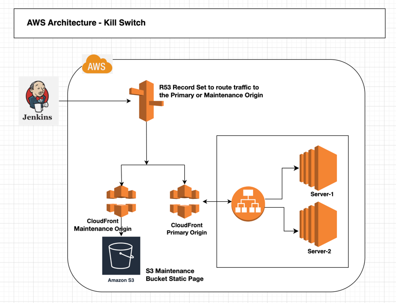

# AWS PoC: to handle the business downtime

This PoC is a switch between the primary site and a maintenance page, during the downtime.

### AWS Architecture:

### Tools:
Jenkins: Pipeline
 AWS Services: CloudFront, S3, R53

### Steps:
**Step-1:** You should have deployed the maintenance page in an Amazon S3 bucket
 **Step-2:** Set up a CloudFront distribution that serves the maintenance page from the S3 bucket.
 **Step-3:** Set up a Route 53 record that points to the CloudFront distribution.
 **Step-4:** Set up a Jenkins job that triggers a script to modify the Route 53 record to point to the CloudFront distribution.
 **Step-5:** Update the Route 53 record set back to the original endpoint, after the maintenance is completed