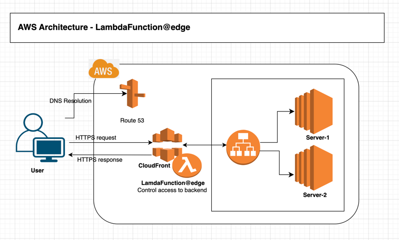

## POC: LamdaFunction@Edge to control Access to the backend

CloudFormation template creates a Lambda@Edge function 
that inspects the X-User header of viewer requests and 
returns an HTTP 403 Forbidden response if the user is not authorized to access the content.

### AWS Architecture:

### Steps to perform:

**Step-1:** Create a Lambda function

**Step-2:** Associate Lambda function with the CloudFront distribution by specifying the function's ARN in the distribution's configuration.